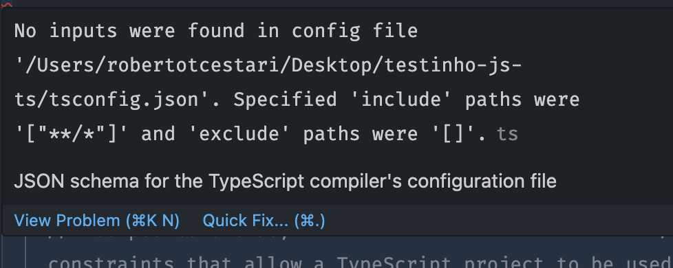
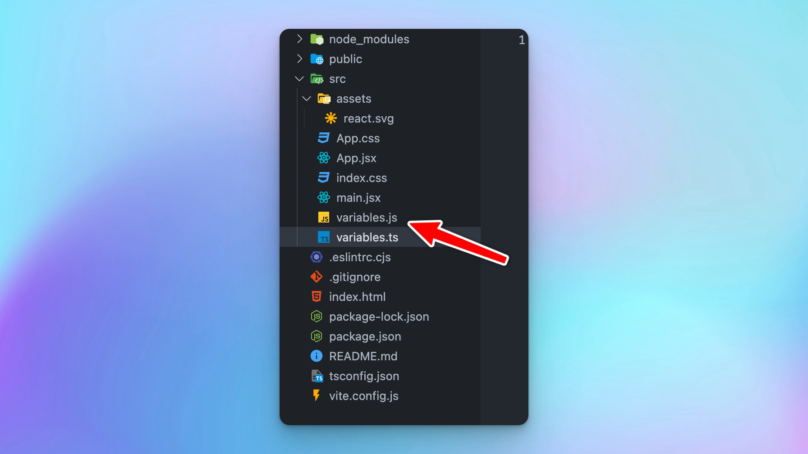

Assim que iniciamos o projeto typescript já deu para perceber que o `tsconfig` já está com erro:

### Erro 01 - Não temos arquivos .ts



Basicamente o compilador está reclamando que não existe nenhum arquivo typescript!

Vamos criar então um arquivo de teste `variables.ts` e adicionar uma variável.

```typescript title="src/variables.ts"
export const workshopName = 'TS no React'
```

Podemos importá-lo em qualquer componente - brinque com isso!

Em qualquer momento, se precisarmos fazer um *type checking*, isto é, testar nossos tipos, basta rodarmos um `npx tsc`.

Mas isso vai gerar um outro erro...

### Erro 02 - O tsc está gerando arquivos .js

Na verdade esse não é um erro, é um comportamento esperado.

Mas para nós que estamos criando aplicações React, não precisamos que o typescript emita arquivos JS. O Vite (ou Next ou Remix) faz isso por nós!



Vamos então mudar as configurações no `tsconfig.json` (depois de limpar os comentários do arquivo).

```json ins={8}
{
  "compilerOptions": {
    "target": "es2016",
    "esModuleInterop": true,
    "forceConsistentCasingInFileNames": true,
    "strict": true,
    "skipLibCheck": true,
    "noEmit": true
  }
}
```
