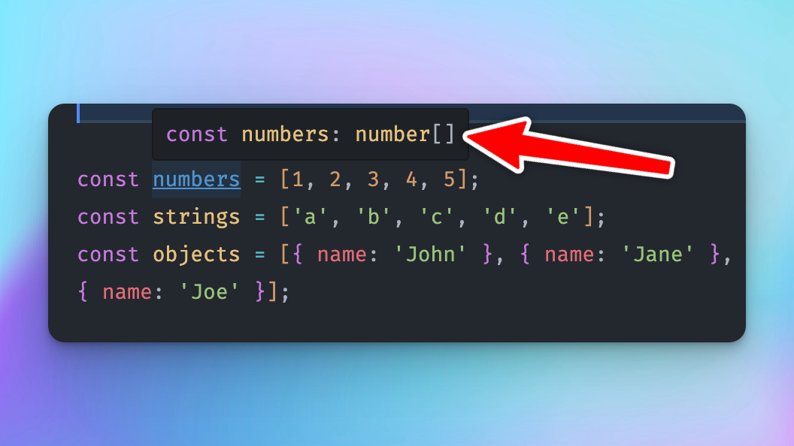
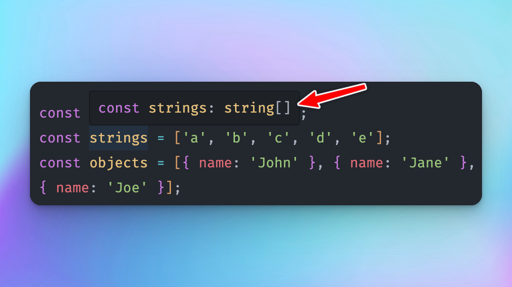
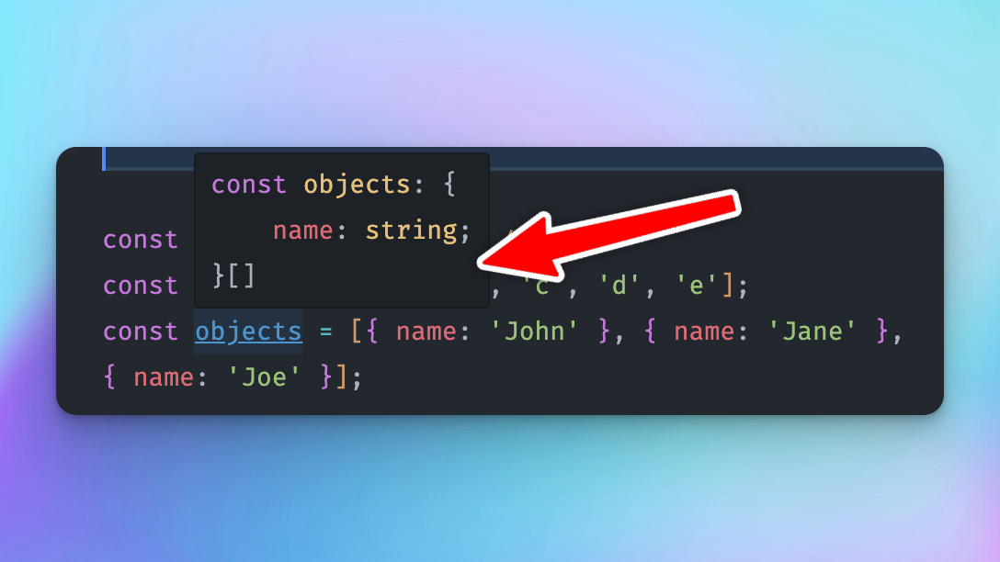

Deu para perceber que a mudança não foi nada drástica. E se eu perguntar para você se esse componente abaixo é um componente escrito em JS ou em TS o que você diria?

```jsx
function Header() {
  return (
    <div>
      <h1>App muito legal</h1>
    </div>
  );
}

export default Header;
```

Não dá para saber e tanto faz. Esse componente é idêntico se é escrito em JS ou TS.

Mas vamos brincar um pouco com a nossa recém convertida aplicação React com Typescript

## O compilador TS é inteligente

... e isso é ótimo, porque quanto mais ele entende o nosso código, menos precisamos nos preocupar com o TS.

Por exemplo, vamos limpar nosso componente `App.tsx` e deixá-lo assim:

```jsx
import './App.css';
import { workshopName } from './variables'

function App() {
  return (
    <div>
      <h1>{workshopName}</h1>
    </div>
  );
}

export default App;
```

Vamos brincar um pouco com TS nesse arquivo mesmo?
Podemos, por exemplo, escrever isso:

```jsx
const numbers = [1, 2, 3, 4, 5];
const strings = ['a', 'b', 'c', 'd', 'e'];
const objects = [{ name: 'John' }, { name: 'Jane' }, { name: 'Joe' }];
```

Quais são os tipos dessas variáveis? É relativamente simples descobrir - basta a gente *dar um hover* em cima da variável, e o VSCode já mostra pra gente:







Deu para perceber que os tipos são, respectivamente, *array de números*, *array de strings*, e *array de objeto com propriedade `name`*.

E isso vamos fazer todo o momento nesse curso (e provavelmente na vida). Como usuários do TS não precisamos "decorar" praticamente nada - é relativamente fácil encontrar os tipos que queremos usando o *hover* e "fuçando" um pouco.

:::note
Como uma "regra de bolso", quando a gente notar que o compilador conseguiu de forma eficaz inferir os tipos (como no exemplo acima), não precisaremos tipar nada!
:::

## Tipar, apenas em último caso

Percebemos que o TS é bastante inteligente para inferir tipos. No caso acima, não faz sentido escrevermos:

```jsx
const numbers: number[] = [1, 2, 3, 4, 5];
```

Não precisamos ser redundantes com TS, por isso a tipagem acima é totalmente desnecessária.

Agora, imagine que essa variável `numbers` possa também receber números como *strings*. A partir desse momento será necessário que façamos uma tipagem:

```jsx
let numbers = [1, 2, 3] // mas, em algum momento no programa esse array poderá também ser: [1, 2, "3"]
```

O correto nesse caso é tiparmos e sermos explícitos: é um *array* que pode receber *números* ou *strings*:

```jsx
const numbers: (string | number)[] = [1, 2, "3"];
```

## O resumo da ópera

Não vamos entrar em muitos detalhes do básico de Typescript, já que não é o propósito desse workshop.

 A mensagem que deve ficar é que: ***a maioria das coisas em uma aplicação React com TS* não precisa ser tipada.** E isso é ótimo!
