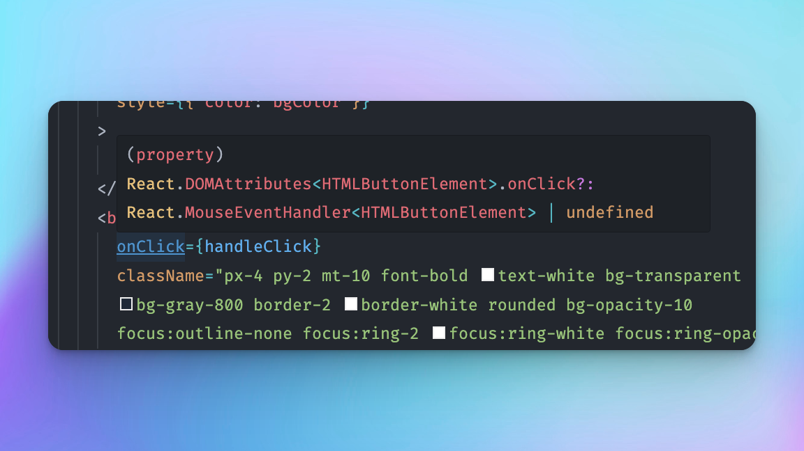

*Veja a [diff no Github](https://github.com/robertotcestari/codante-ts-no-react-exercicio/compare/resolucao-props-children-exercicio-1...resolucao-eventos-e-event-handlers-exercico-1)*

## Extraindo parte do `App` para um `HeaderCard`

Vamos começar criando o arquivo `src/components/HeaderCard.tsx`. Por enquanto vamos colocar alguns tipos apenas para deixarmos o compilador feliz.

```jsx
type HeaderCardProps = {
  bgColor: string,
  handleClick: () => void,
};

export default function HeaderCard({ bgColor, handleClick }: HeaderCardProps) {
  return (
    <div className="w-full max-w-4xl px-10 py-6 mx-auto bg-white border-2 border-white rounded-lg bg-opacity-15 ">
      <h1
        className="font-bold brightness-50 text-7xl font-display"
        style={{ color: bgColor }}
      >
        Frases Motivacionais
      </h1>
      <button
        onClick={handleClick}
        className="px-4 py-2 mt-10 font-bold text-white bg-transparent bg-gray-800 border-2 border-white rounded bg-opacity-10 focus:outline-none focus:ring-2 focus:ring-white focus:ring-opacity-50"
      >
        Me dê uma dose de ânimo
      </button>
    </div>
  );
}
```

Mas será que não podemos melhorar nos tipos das props aqui?

Vamos usar a técnica do "hover" para tentar inferir o tipo de um *event handler*?

Vamos ver:



Veja que o tipo esperado em um `onClick` é um `MouseEventHandler` que recebe como argumento (generics) o elemento clicado - nesse caso um `HTMLButtonElement`.

Vamos usar isso então para tipar nossas props:

```jsx ins={3}
type HeaderCardProps = {
  bgColor: string;
  handleClick: React.MouseEventHandler<HTMLButtonElement>;
};

```

Pronto, bem melhor. E nem precisamos "decorar" o tipo para colocar aqui! 😎

## Criando um botão que troca cor do fundo

Vamos agora para a segunda parte do nosso exercício, que é criar um botão que troca aleatoriamente apenas o fundo.

Em primeiro lugar vamos adicionar o botão:

```jsx ins={17-22}
export default function HeaderCard({ bgColor, handleClick }: HeaderCardProps) {
  return (
    <div className="w-full max-w-4xl px-10 py-6 mx-auto bg-white border-2 border-white rounded-lg bg-opacity-15 ">
      <h1
        className="font-bold brightness-50 text-7xl font-display"
        style={{ color: bgColor }}
      >
        Frases Motivacionais
      </h1>
      <button
        onClick={handleClick}
        className="px-4 py-2 mt-10 font-bold text-white bg-transparent bg-gray-800 border-2 border-white rounded bg-opacity-10 focus:outline-none focus:ring-2 focus:ring-white focus:ring-opacity-50"
      >
        Me dê uma dose de ânimo
      </button>

      <button
        className="px-4 py-2 mt-10 ml-3 font-bold text-white bg-transparent bg-gray-800 border-2 border-white rounded bg-opacity-10 focus:outline-none focus:ring-2 focus:ring-white focus:ring-opacity-50"
      >
        Trocar a Cor
      </button>
    </div>
  );
}
```

Agora, vamos criar outra função que deverá ser passada do `App` até o novo botão:

```jsx title="src/App.tsx" ins={12-15,23}
function App() {
  const [quote, setQuote] = useState({ quote: '', author: '', id: '' });
  const [bgColor, setBgColor] = useState('#666');

  async function handleClick() {
    const quote = await fetchQuote();
    const color = await fetchRandomColor();
    setQuote(quote);
    setBgColor(color.hex);
  }

  async function handleChangeColorClick() {
    const color = await fetchRandomColor();
    setBgColor(color.hex);
  }

  return (
    <main className="w-full min-h-screen " style={{ backgroundColor: bgColor }}>
      <section className="container px-10 py-20 mx-auto text-center">
        <HeaderCard
          bgColor={bgColor}
          handleClick={handleClick}
          handleChangeColorClick={handleChangeColorClick}
        />
        {quote && <QuoteCard quote={quote} />}
      </section>{' '}
    </main>
  );
}

export default App;

```
