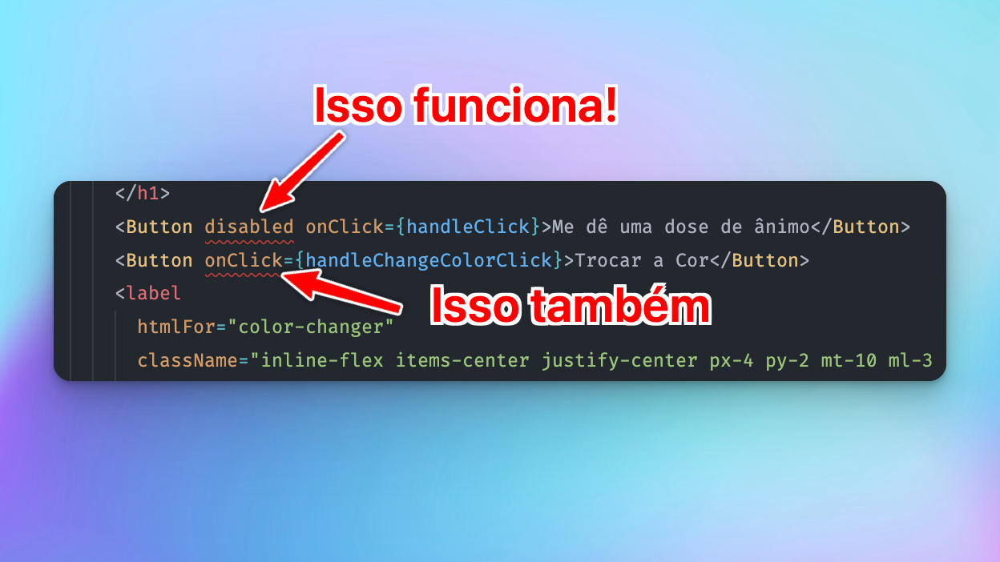
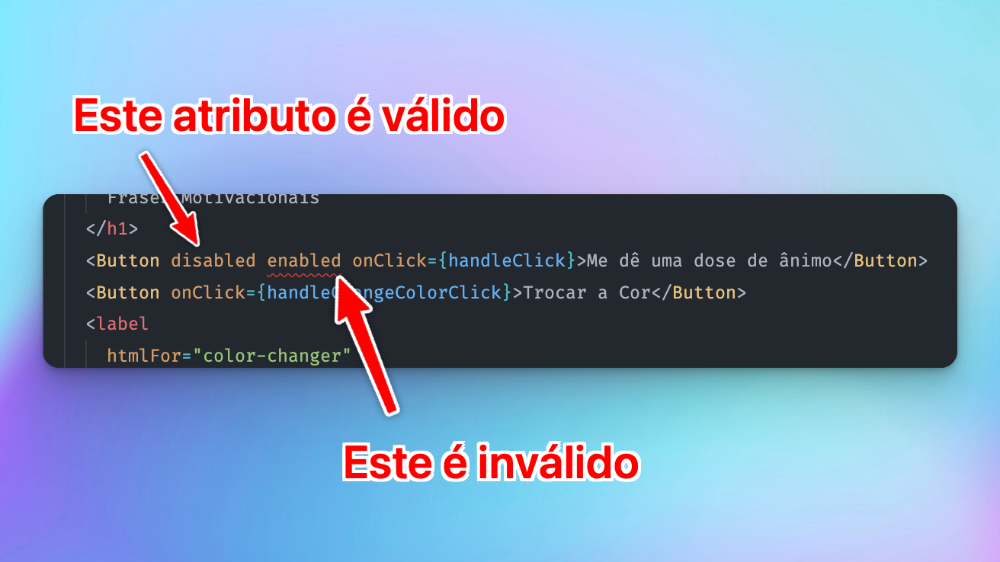

*Veja a [diff no Github](https://github.com/robertotcestari/codante-ts-no-react-exercicio/compare/resolucao-eventos-e-event-handlers-exercico-2...resolucao-componentes-flexiveis)*

Esse exercício possui várias partes. Vamos então, parte por parte, resolvê-lo.

## Extraindo um componente `Button` e tipando o `children`

Antes de mais nada, vamos criar um componente `Button`. Poderíamos fazer algo como"

```jsx title="src/components/Button"
import { PropsWithChildren } from 'react';

type ButtonProps = PropsWithChildren;

function Button({ children }: ButtonProps) {
  return (
    <button className="px-4 py-2 mt-10 font-bold text-white bg-transparent bg-gray-800 border-2 border-white rounded bg-opacity-10 focus:outline-none focus:ring-2 focus:ring-white focus:ring-opacity-50">
      {children}
    </button>
  );
}

export default Button;
```

## Recebendo (e repassando) o onClick

Vamos receber então a função que deverá ser disparada no clique. Com isso, vamos criar a prop `onClick`. Mas isso por si só não basta. Também precisamos repassá-la ao elemento html, que é o nosso `<button>` (com letra minúscula!):

```jsx title="src/components/Button" ins={3-5,7,9}
import { PropsWithChildren } from 'react';

type ButtonProps = PropsWithChildren<{
  onClick: React.MouseEventHandler<HTMLButtonElement>,
}>;

function Button({ children, onClick }: ButtonProps) {
  return (
    <button
      onClick={onClick}
      className="px-4 py-2 mt-10 font-bold text-white bg-transparent bg-gray-800 border-2 border-white rounded bg-opacity-10 focus:outline-none focus:ring-2 focus:ring-white focus:ring-opacity-50"
    >
      {children}
    </button>
  );
}

export default Button;
```

## Substituindo os botões pelo novo componente

Vamos agora usar nosso novo botão:

```jsx title="src/components/HeaderCard.tsx ins={24,25}
import Button from './Button';

type HeaderCardProps = {
  bgColor: string,
  handleClick: React.MouseEventHandler<HTMLButtonElement>,
  handleChangeColorClick: React.MouseEventHandler<HTMLButtonElement>,
  setBgColor: React.Dispatch<React.SetStateAction<string>>,
};

export default function HeaderCard({
  bgColor,
  handleClick,
  handleChangeColorClick,
  setBgColor,
}: HeaderCardProps) {
  return (
    <div className="w-full max-w-4xl px-10 py-6 mx-auto bg-white border-2 border-white rounded-lg bg-opacity-15 ">
      <h1
        className="font-bold brightness-50 text-7xl font-display"
        style={{ color: bgColor }}
      >
        Frases Motivacionais
      </h1>
      <Button onClick={handleClick}>Me dê uma dose de ânimo</Button>
      <Button onClick={handleChangeColorClick}>Trocar a Cor</Button>
      <label
        htmlFor="color-changer"
        className="inline-flex items-center justify-center px-4 py-2 mt-10 ml-3 font-bold text-white bg-transparent bg-gray-800 border-2 border-white rounded cursor-pointer bg-opacity-10 focus:outline-none focus:ring-2 focus:ring-white focus:ring-opacity-50"
      >
        Cor manual
        <input
          onChange={(e) => setBgColor(e.currentTarget.value)}
          type="color"
          name=""
          id="color-changer"
          className="w-0 h-0"
        />
      </label>
    </div>
  );
}
```

## Passando a prop disabled

Assim como passamos a prop `onClick`, definindo ela no nosso componente, poderíamos fazer a mesma coisa com outras props que quiséssemos utilizar. Nesse caso, precisamos agora da prop `disabled`.

:::caution
Percebeu um padrão? Se continuarmos assim, nosso componente `<Button>` aumentaria a cada prop que utilizaríamos
:::

Não faz muito sentido: se tivéssemos um simples `<button>` html já teríamos todas as props que o HTML nos dá. Mas a partir do momento em que fazemos um `<Button>` personalizado precisamos criar cada uma dessas props novamente? Será que não há um jeito melhor?

Sim, há.

### Passando não apenas a prop disabled, mas todas os atributos de um botão

Ok, vamos então fazer isso. E para isso funcionar, vamos usar o `rest` e o `spread` operator. O `rest` para "pegarmos" toda e qualquer prop que for passada para nosso `<Button>`. O `spread` para repassarmos para nosso elemento `<button>`. Com isso posso até apagar a prop `onClick`!

Veja como nosso componente vai ficar muito mais simples (e funcionando ainda melhor):

```jsx title="src/components/Button.tsx" ins={5,7}
import { PropsWithChildren } from 'react';

type ButtonProps = PropsWithChildren;

function Button({ children, ...props }: ButtonProps) {
  return (
    <button {...props} className="px-4 py-2 mt-10 font-bold text-white bg-transparent bg-gray-800 border-2 border-white rounded bg-opacity-10 focus:outline-none focus:ring-2 focus:ring-white focus:ring-opacity-50">
      {children}
    </button>
  );
}

export default Button;
```

Mas ainda falta uma coisa. O botão funciona, podemos passar o `disabled` para ele e o disabled funciona como esperado também. Mas o TS não está gostando e está apontando erro:



O que falta aqui é dizer para o *typescript* que todas essas props que podemos receber são props específicas do botão. E nosso componente pode aceitar *quaisquer* props de botão!

#### O tipo utilitário `ComponentPropsWithoutRef` vai nos salvar 🙏

Podemos manter tudo simples e apenas utilizar o tipo utilitário `ComponentPropsWithoutRef`. Esse tipo deve receber como parâmetro qual elemento html estamos querendo "emular" (nesse caso um `button`). E voilá! Todos os atributos html de um botão já estão tipados em nosso componente.

Podemos usar então o `disabled`, o `onClick`, o `type`, e centenas de outros atributos de `<button>` diretamente em nosso componente `<Button>`!

```jsx title="src/components/Button.tsx" ins={3}
import { ComponentPropsWithoutRef } from 'react';

type ButtonProps = ComponentPropsWithoutRef<'button'>;

function Button({ children, ...props }: ButtonProps) {
  return (
    <button
      {...props}
      className="px-4 py-2 mt-10 font-bold text-white bg-transparent bg-gray-800 border-2 border-white rounded bg-opacity-10 focus:outline-none focus:ring-2 focus:ring-white focus:ring-opacity-50"
    >
      {children}
    </button>
  );
}

export default Button;
```

Maravilha! Agora temos um componente realmente flexível, simples e sem erros de tipagem!

Teste você: tente passar uma prop específica de um botão que nosso componente aceitará. Mas se tentar passar uma prop que não é de um botão, nosso componente irá reclamar!


