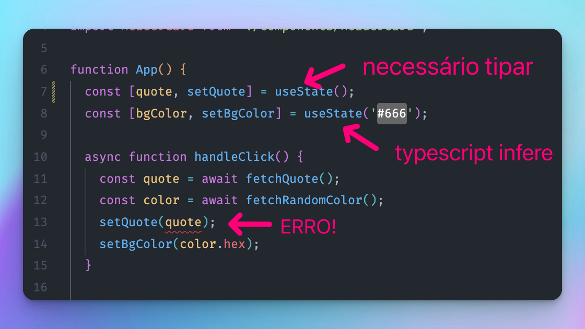

## Tipando useState

Na maioria das vezes não é necessário tipar o `useState` - uma vez que o tipo será inferido do estado inicial.

Entretanto, algumas vezes o estado é inicializado com `null` ou `undefined`, de forma que precisamos dizer qual é o tipo do estado. Nesses casos precisamos tipar.



Consegue identificar por que razão o primeiro caso é necessário tipar mas o segundo não?

**O primeiro** está sendo inicializado como `undefined` e precisamos "dizer" para o Typescript que esse estado será ou `undefined` ou `Quote`.

**O segundo** já é inicializado com `string`, logo o Typescript infere que o estado é `string`.

Podemos resolver simplesmente passando o tipo `Quote` como _generics_ do `useState`:

```jsx title="src/App.tsx"
  const [quote, setQuote] = useState<Quote>();
```

isso fará que o estado seja do tipo `Quote | undefined`
