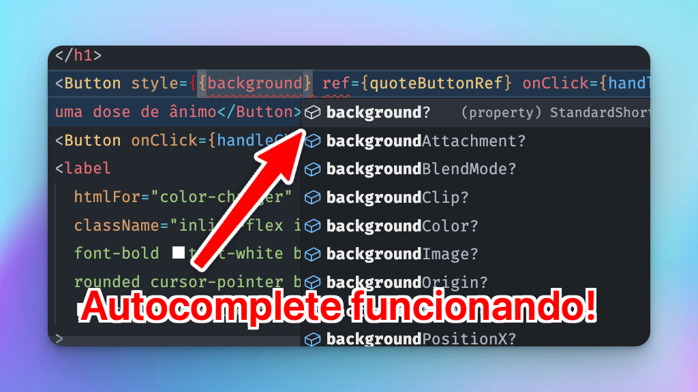
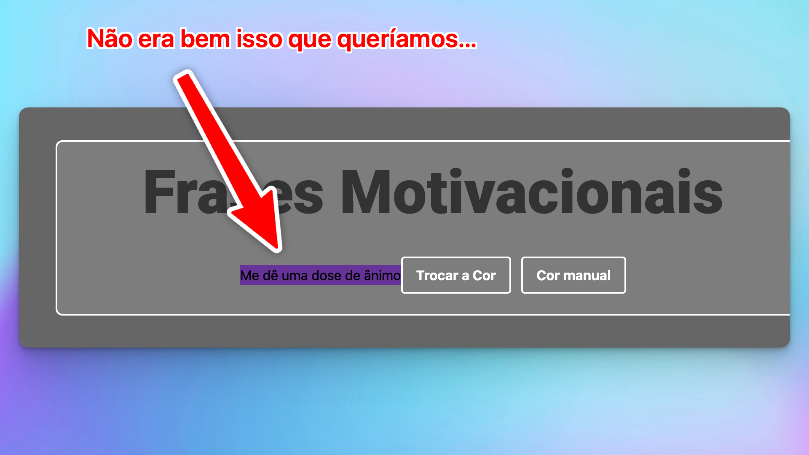

## Qual é o problema que estamos resolvendo?

Se você ainda não percebeu, nosso componente está flexível em praticamente todos aspectos de um botão html: todas os atributos esperados vêm tipados e prontos.

Entretanto, como estamos aqui usando Tailwind, será comum a alteração dos `classNames`. Vamos tentar fazer isso e ver o que acontece. Eu quero que o primeiro botão fique com o fundo da cor `rebeccapurple` (se não me engano é a última cor nomeada - _named colors_ - adicionada no CSS).

Fazer isso alterando a prop style é uma maravilha e fácil:



Mas se fizermos isso usando tailwindCSS vai dar erro.

É claro, o `className` no componente está _hard-coded_, e de duas uma:

- Se o spread do `{...props}` estiver antes do `className`, nada vai acontecer - e nenhum estilo vai ser aplicado.
- Se o spread do `{...props}` estiver depois do `className`, tudo vai ser sobrescrito e o único estilo vai ser o `backgroundColor` que você passou!



### Uma solução não definitiva

a solução intuitiva (e que já usei várias vezes) é receber o `classNames` como props e adicioná-lo à string de classNames usando _template strings_:

```jsx title="src/components/Button.tsx" ins={3-5,8,12}
import { ComponentPropsWithRef, forwardRef } from 'react';

type ButtonProps = ComponentPropsWithRef<'button'> & {
  className?: string;
} ;

const Button = forwardRef<HTMLButtonElement, ButtonProps>(
  ({ children, className, ...props }, ref) => {
    return (
      <button
        ref={ref}
        className={`px-4 py-2 mt-10 font-bold text-white bg-transparent bg-gray-800 border-2 border-white rounded bg-opacity-10 focus:outline-none focus:ring-2 focus:ring-white focus:ring-opacity-50 ${className}`}
        {...props}
      >
        {children}
      </button>
    );
  }
);

export default Button;

```

Isso pode funcionar em alguns casos (e funciona no caso da cor). Mas o método não é nada confiável.

Isso porque pode haver conflito de classes definidas dentro do componente com as classes que você passar quando instanciar/utilizar o componente.

Por exemplo, se eu passar um `p-0` ao usar meu componente, esse estilo não vai funcionar já que dentro do componente já tem um `px-4` e um `py-2` e todas essas classes vão entrar em conflito.

## A solução definitiva

> "Se eu vi mais longe, foi por estar de pé sobre ombros de gigantes."

Vamos procurar um "gigante" para subir no ombro dele e tentar encontrar a resposta?

O gigante aqui vai ser o `shadcn`, que fez uma das mais populares bibliotecas de `ui` de react com typescript.

Ele resolve esse problema fazendo uma função auxiliar que dá o nome de `cn`. Vamos "copiá-la" também?

Para isso, vamos adicionar um arquivo `utils` em `lib/utils.ts`.

```typescript title="src/lib/utils.ts"
import { clsx, type ClassValue } from 'clsx';
import { twMerge } from 'tailwind-merge';

export function cn(...inputs: ClassValue[]) {
  return twMerge(clsx(inputs));
}
```

A `clsx` é uma lib para juntar condicionalmente nomes de classes. É frequentemente utilizada em aplicações React para lidar com classes dinâmicas baseadas em diferentes condições.

A `tailwind-merge` serve justamente para resolver conflitos em classes do TailwindCSS, permitindo um agrupamento mais eficiente de estilos (o caso do `p-0` combinado com `px-1`).

a função `cn` que é exportada vai dar sempre prioridade para os últimos argumentos adicionados. Então podemos utilizá-lo no nosso `<Button>` dessa forma:

```jsx title="src/components/Button.tsx" ins={6-9}
const Button = forwardRef<HTMLButtonElement, ButtonProps>(
  ({ children, className, ...props }, ref) => {
    return (
      <button
        ref={ref}
        className={cn(
          "px-4 py-2 mt-10 font-bold text-white bg-transparent bg-gray-800 border-2 border-white rounded bg-opacity-10 focus:outline-none focus:ring-2 focus:ring-white focus:ring-opacity-50",
          className
        )}
        {...props}
      >
        {children}
      </button>
    );
  }
);
```

Pronto! Agora sim nosso componente está **verdadeiramente flexível**!
